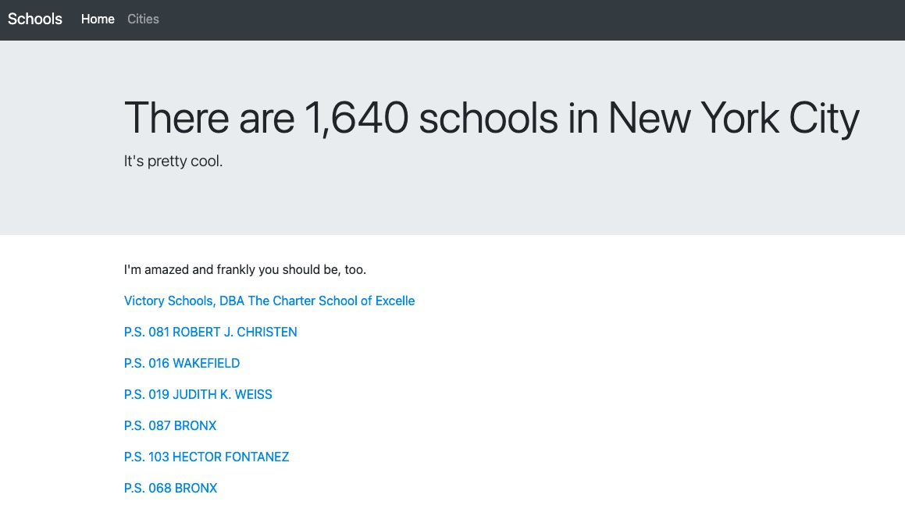
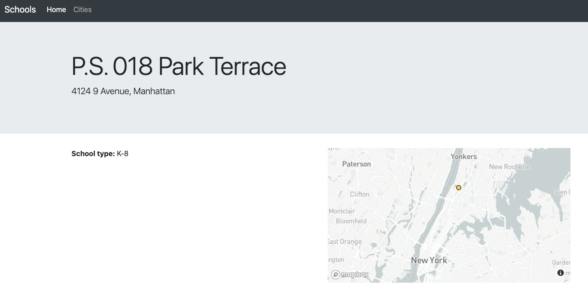

Demo app to list schools info from a database, and on cliking a school, displaying further info and a map with the location shown.

Technology stack in use:

- Flask, a Python web application framework
- HTML to draw a page, through the render_template method
- CSS via Bootstrap to beautify our web page
- SQLite, our database system
- SQLAlchemy, our ORM (Object-relational mapping between Python and SQL)
- Jinja, a templating engine to add data from our database onto our web page

[Reference](http://jonathansoma.com/tutorials/flask-sqlalchemy-mapbox/)

## Run & Develop locally
Run locally and dev:
* `python3 -m venv venv`
* `source venv/bin/activate`
* `(venv) $ pip install -r requirements.txt`
* `(venv) $ python3 app.py --port 5000`

## Docker
- docker build -t tutorial-flask .
- docker run -p 8080:5000 tutorial-flask:latest
- Navigate to localhost:8080